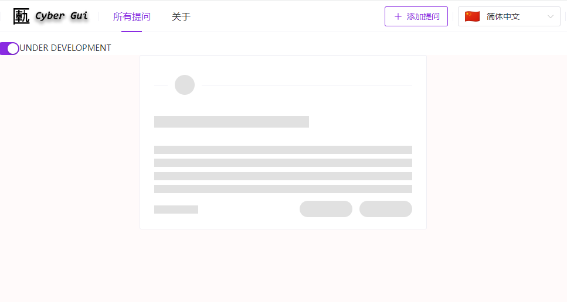

<h1 align="center">
  <br>
  <a href="http://www.amitmerchant.com/electron-markdownify"></a>
  <br>
  Cyber Gui
  <br>
</h1>

<h4 align="center">A lightweight anonymous question box.</h4>

<p align="center">


[](https://www.paypal.me/MoriTokugawa)


</p>

<p align="center">
  <a href="#key-features">Key Features</a> •
  <a href="#project-setup">Project Setup</a> •
  <a href="#credits">Credits</a> •
  <a href="#future-plan">Future Plan</a> •
  <a href="#license">License</a>
</p>



The word 匭(Gui) is a box that the emperor accepts submissions from his people in order to correct his mistakes.

## Key Features

* Lightweight - No redundancy features
* Full anonymous
  - No need to leave a email or other things involve your privacy.
  - Random avatar color.
* Multi language
* Out of the box and ready to use
  - SQLite
  - No need to create an account

## Project Setup

```sh
npm install
```

### Compile and Hot-Reload for Development

```sh
npm run dev
```

### Compile and Minify for Production

```sh
npm run build
```

### Run Unit Tests with [Vitest](https://vitest.dev/)

```sh
npm run test:unit
```

### Run End-to-End Tests with [Cypress](https://www.cypress.io/)

```sh
npm run test:e2e:dev
```

This runs the end-to-end tests against the Vite development server.
It is much faster than the production build.

But it's still recommended to test the production build with `test:e2e` before deploying (e.g. in CI environments):

```sh
npm run build
npm run test:e2e
```

### Lint with [ESLint](https://eslint.org/)

```sh
npm run lint
```


## Credits

Thanks to:

- [anzai249](http://electron.atom.io/)
(It's me.)
- [anzai249](http://electron.atom.io/)
(Japanese translation.)

This software uses the following open source packages:

- [Node.js](https://nodejs.org/)
- [Naive UI](https://www.naiveui.com)

## Future Plan

* Translation
  - [x] Simplified Chinese
  - [x] Traditional Chinese
  - [x] English
  - [ ] Japanese

- [ ] BackEnd Manager
- [ ] Blur sensitive posts

## Support

[](https://ko-fi.com/B0B0668ZJ)

or

</img>

## License

MIT

---
